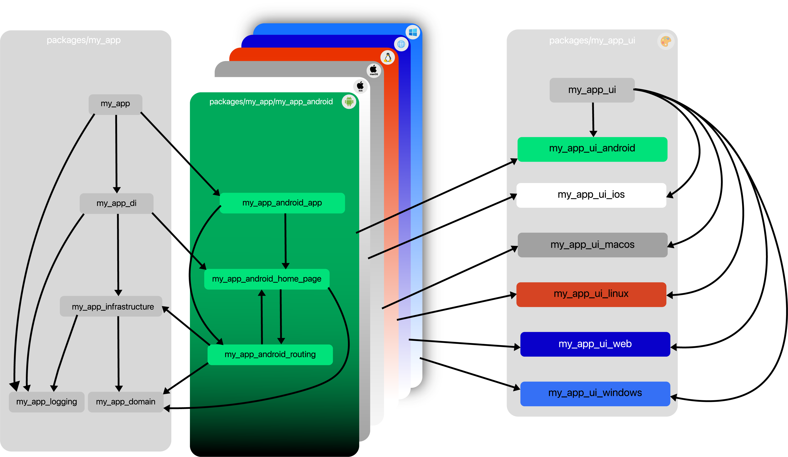

---

🚨🚨🚨 NOT STABLE 🚨🚨🚨

This is under heavy development and not yet ready for real world use.

---

## Well architectured Flutter apps. Fast ⚡

Rapid is based on carefully selected packages from the Flutter Community and brings their power together. No headaches about messing up your architecture when adding new features. Rapid enables developers to quickly iterate and focus on what really matters.

| Package                                                                          | Description |
| -------------------------------------------------------------------------------- | ----------- |
| [rapid_cli](https://github.com/jtdLab/rapid/tree/main/packages/rapid_cli)        | Command Line Interface for development |
| [rapid]()          | TODO |
| [rapid_test]() | TODO |

## What packages is Rapid based on? 👀

| Task                   | via                                     |
| ---------------------- |:---------------------------------------:|
| Project Management     | [melos](https://pub.dev/packages/melos) |
| Dependency Injection   | [getIt](https://pub.dev/packages/get_it), [injectable](https://pub.dev/packages/injectable) |
| Routing                | [auto_route](https://pub.dev/packages/auto_route) |
| Theming                | [theme_tailor](https://pub.dev/packages/theme_tailor) |
| Localization           | [flutter_localizations](https://docs.flutter.dev/development/accessibility-and-localization/internationalization) |
| State Management       | [bloc](https://pub.dev/packages/bloc) |
| Immutability           | [freezed](https://pub.dev/packages/freezed) |

Special thanks to all developers/contributors of these packages ❤️

## Architecture

## Platform-independent Packages

### `<project_name>_app`

Contains the setup and bootstraping of the application depending on platform and environment.

### `<project_name>_logging`

Contains the logging of the application.

### `<project_name>_di`

Contains the dependency injection of the application.

### `<project_name>_domain`

Contains the platform independent domain layer. This consists of service interfaces, entitys, value objects and failures.

### `<project_name>_infrastructure`

Contains implementation of the domain layer. This consists of service implementations and data transfer objects.

## Platform-dependent Packages

Contains features of the specific platform.

### `<project_name>_<platform>_app`

The app feature. A required feature that provides the root widget of the related platform

### `<project_name>_<platform>_routing`

The routing feature. A required feature that provides a router where pages get registered.
The router is used in other features to navigate.

### Custom Features

### `<project_name>_<platform>_<feature_name>`

Custom features.

## UI Packages

Pure Flutter packages containing the Design Language of the Rapid project.
What [`material`](https://docs.flutter.dev/development/ui/widgets/material), [`cupertino`](https://docs.flutter.dev/development/ui/widgets/cupertino), [`macos_ui`](https://pub.dev/packages/macos_ui) or [`fluent_ui`](https://pub.dev/packages/fluent_ui) is to Android, iOS, macOS or Windows
the UI Packages are to your Rapid project.

### Platform-independent UI Packages

### `<project_name>_ui`

Contains platform independent Design Language.

### Platform-dependent UI Packages

### `<project_name>_ui_<platform>`

Contains platform dependent Design Language. Builds on top of the platform independent `ui` package and existing ui libraries like [`material`](https://docs.flutter.dev/development/ui/widgets/material), [`cupertino`](https://docs.flutter.dev/development/ui/widgets/cupertino), [`macos_ui`](https://pub.dev/packages/macos_ui) or [`fluent_ui`](https://pub.dev/packages/fluent_ui).

<!-- ## Core principles

### Modularity

Rapid aims to keep scopes small and thus uses a multi package approach. The packages are managed
in a mono repo using [melos](https://melos.invertase.dev/).

### Shared Domain

Rapids archticture evolvs around a platform independent domain layer.

### Single Responsibility

Every package has its clear responsibility.

### Extensibility

Features can be added easily.

### Unidirectional Data Flow

Data only flows from the outside through the app to the view and backwards.
 -->
